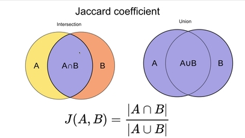
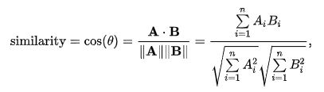
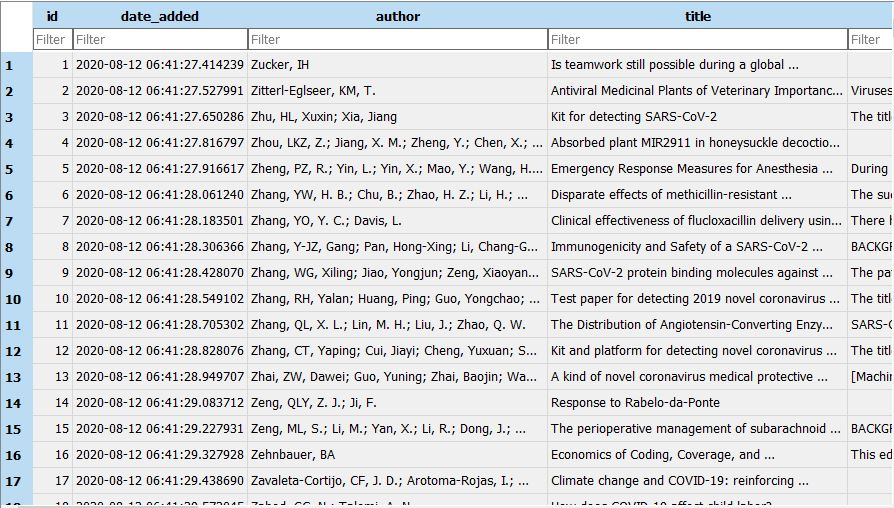
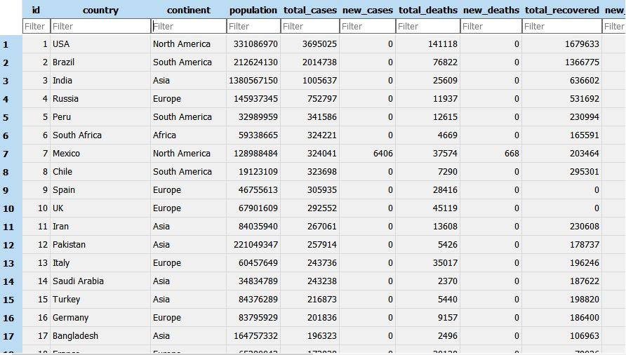

# dbmsjaccard

**Project Title**

Keyword Searching using Jaccard Similarity. The project is based on using Jaccard Similarity for improving query searching and efficiency. The project will focus on optimizing query to improve the searching time.

**Project Description**

Article Searching is the process of searching the appropriate words based on user description or keywords. Normally in traditional keyword searching, the process takes more time and the search result is not that efficient or accurate matching the article. There are various algorithms and methods used for information retrieval with the use of search engines. In this paper, we have used Jaccard Similarity. 
Jaccard similarity is an algorithm to compare one document to another based on string that they have. Jaccard similarity is usually used in document comparison to find the similarity value of the documents. Based on this ability, Jaccard similarity is used in dynamic query suggestions to give some suggestions to user in article searching process. Results show that Jaccard similarity query suggestions produce more accurate results compared to the traditional MySql pattern searching but has disadvantage it takes more processing time.

**Jaccard Similarity**

The formula to find the Index is:
**Jaccard Index = (the number in both sets) / (the number in either set) * 100**

The same formula in notation is:
**J(X,Y) = |X∩Y| / |X∪Y|**

**Cosine Similarity**

The cosine of two non-zero vectors can be derived by using the Euclidean dot product formula:
**Cosine Similarity: A.B = ||A|| ||B|| cosθ**

**Database**

The project uses the SQLlite3 database and COVID worldwide dataset which consists of articles by different authors retrieved from different dataset and merged into a single dataset. For simplicity, the first 500 records in our CoronaArticles models and corona_world_statistics_coronaarticles database table. The snippet of part of the data is show in the attachment below:

To supplement the project for additional research on numbers, the COVID worldwide dataset is also used. The snippet of data is shown in the attachment below:

